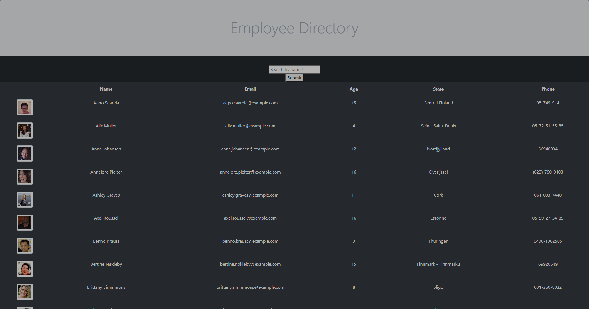
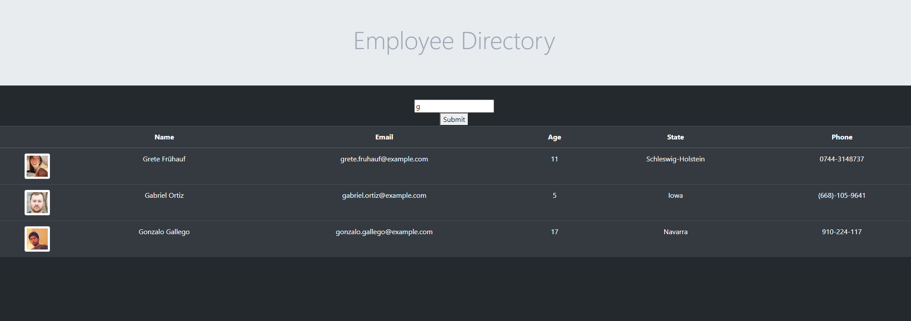

# Project WORM

 

* [Pirooz Wallace](https://github.com/attack-theoRy)

[Deployed GitHub Pages App](https://attack-theory.github.io/employee-directory/)

## Table of Contents
* [Description](#description)
* [User Story](#user-story)
* [Installation](#installation)
* [Tech](#tech)
* [License](#license)
* [Questions](#Questions)
* [Credits](#Credits)

## Description

Employee Directory is a React app that takes a list of employees / users retrieved from a random user generator api and displays them in a table. The names can be sorted in alphabetical order by clicking "Name" at the top. 

The table can also be filtered by name by typing in the input at the top. It filters in real-time with no need to submit.

## Installation

None needed, use the Github Pages deploy link

To install repo locally
` npx create-react-app ` 
` npm init -y`
` npm i bootstrap `
` npm i axios `
run `npm start ` and open a browser to http://localhost:3000/employee-directory

## Tech

* React
* CSS
* NodeJS
* Random User API 
* Bootstrap

## Questions

Email: PiroozWallace@outlook.com
 
Visit my portfolio at: https://attack-theory.github.io/Portfolio/

## License 

Licensed under the 

MIT License

Copyright (c) 2021 - Pirooz Wallace

Permission is hereby granted, free of charge, to any person obtaining a copy
of this software and associated documentation files (the "Software"), to deal
in the Software without restriction, including without limitation the rights
to use, copy, modify, merge, publish, distribute, sublicense, and/or sell
copies of the Software, and to permit persons to whom the Software is
furnished to do so, subject to the following conditions:

The above copyright notice and this permission notice shall be included in all
copies or substantial portions of the Software.

THE SOFTWARE IS PROVIDED "AS IS", WITHOUT WARRANTY OF ANY KIND, EXPRESS OR
IMPLIED, INCLUDING BUT NOT LIMITED TO THE WARRANTIES OF MERCHANTABILITY,
FITNESS FOR A PARTICULAR PURPOSE AND NONINFRINGEMENT. IN NO EVENT SHALL THE
AUTHORS OR COPYRIGHT HOLDERS BE LIABLE FOR ANY CLAIM, DAMAGES OR OTHER
LIABILITY, WHETHER IN AN ACTION OF CONTRACT, TORT OR OTHERWISE, ARISING FROM,
OUT OF OR IN CONNECTION WITH THE SOFTWARE OR THE USE OR OTHER DEALINGS IN THE
SOFTWARE.
